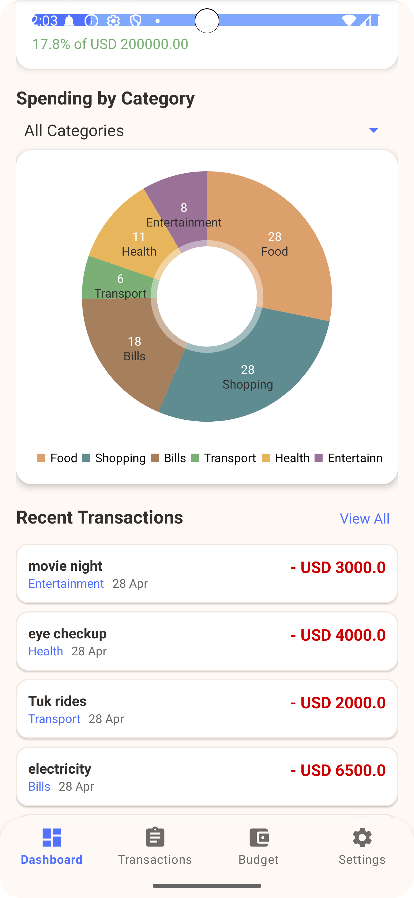

# 📱 PennyPilot - Personal Finance Tracker 📈💰

**PennyPilot** is a simple and intuitive mobile app built with **Kotlin** that helps users track their **income**, **expenses**, and **savings** effectively.  
This project was developed for the **Mobile Application Development (IT2010)** module at **SLIIT**, as part of the **2nd Year CA Component 3 - Lab Exam 03**.

---

## 🚀 Features

### Core Features
- **Transaction Management**
  - Add, edit, and delete income and expense transactions.
  - Each transaction includes title, amount, category, and date.

- **Category-wise Spending Analysis**
  - Categorize expenses (e.g., Food, Transport, Bills, Entertainment).
  - View a summary of expenses by category.

- **Monthly Budget Setup**
  - Set a monthly budget and track progress.
  - Receive warnings when spending approaches or exceeds the limit.

- **Data Persistence**
  - Save user preferences and transaction history using **SharedPreferences**.

### Bonus Features
- **Data Backup and Restore**
  - Export and restore transaction data using **Internal Storage** (text or JSON format).

- **Push Notifications**
  - Get notified when nearing or exceeding the monthly budget.
  - Optional daily reminders to record expenses via **Android Notification Manager**.

---

## 🛠️ Tech Stack

- **Language**: Kotlin
- **IDE**: Android Studio
- **UI Design**: XML Layouts (Clean and user-friendly)
- **Data Storage**: SharedPreferences & Internal Storage
- **Notifications**: Android's Notification Manager

---

## 📋 How to Run

1. Clone this repository:
   ```bash
   git clone https://github.com/layara-S/Personal-Finance-Tracker.git

2. Open the project in Android Studio.

3. Connect an Android device or use an emulator.

4. Build and run the app!

## 📸 Screenshots

| Home Page | Logo Page |
|:---------:|:---------:|
|  |  |


